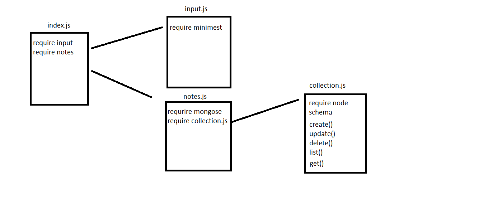

# LAB - Class 4

## Project: lab-04

### Author: Alaa almasri

### Documentaion
## to create a new item in database write the fellowing command

>node index.js --create `<value>` --catagory `<value>`

## to get an item in the database

>node index.js --get `<id>`

## to list an item  or all items in the database

to get all items
code:
>node index.js --list
to get spesfic item
code:
>node index.js --list --catagory `<value>` for spesfic catagory

## to delete an item   in the database
>node index.js --delete  `<id>` 

## to update an item   in the database
>node index.js --update --text `<value>`

### Links and Resources

- [submission PR](https://github.com/alaaalmasri12/notes-v-2.0/pull/2)
- [ci/cd](https://github.com/alaaalmasri12/notes-v-2.0/actions/runs/117805220) (GitHub Actions)

### Setup

#### `.env` requirements (where applicable)

i.e.

- `PORT` - Port Number
- `MONGODB_URI` - URL to the running mongo instance/db

#### How to initialize/run your application (where applicable)

- e.g. `node index.js`

#### How to use your library (where applicable)

#### Tests

- How do you run tests?
- Any tests of note?
- Describe any tests that you did not complete, skipped, etc

#### UML

