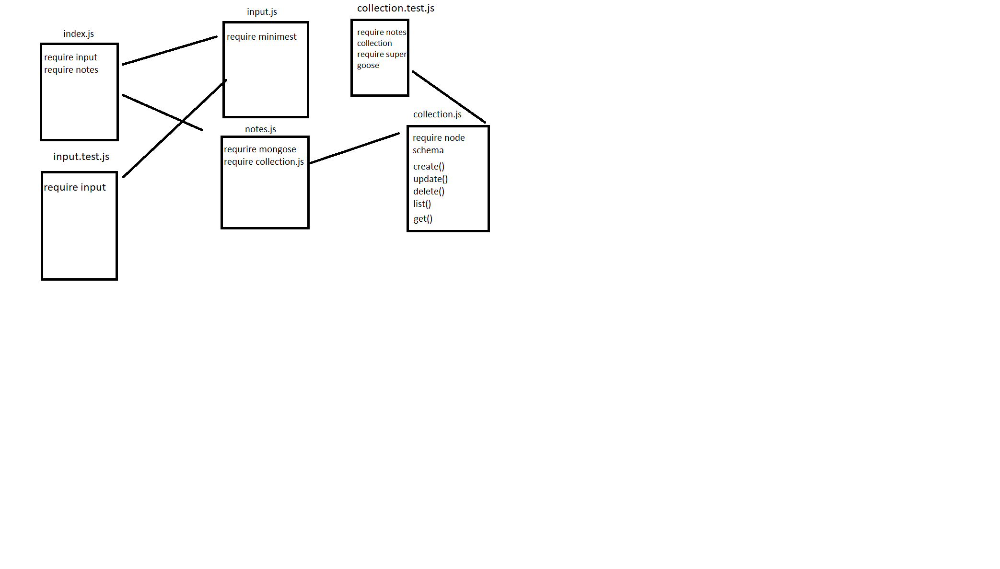

# LAB - Class 4

## Project: lab-04

### Author: Alaa almasri

### Links and Resources

- [submission PR](https://github.com/alaaalmasri12/notes/pull/9)
- [ci/cd](https://github.com/alaaalmasri12/notes/actions/runs/112446351) (GitHub Actions)

### Setup

#### `.env` requirements (where applicable)

i.e.

- `PORT` - Port Number
- `MONGODB_URI` - URL to the running mongo instance/db

#### How to initialize/run your application (where applicable)

- e.g. `node index.js`

#### How to use your library (where applicable)

#### Tests

- How do you run tests?
- Any tests of note?
- Describe any tests that you did not complete, skipped, etc

#### UML

